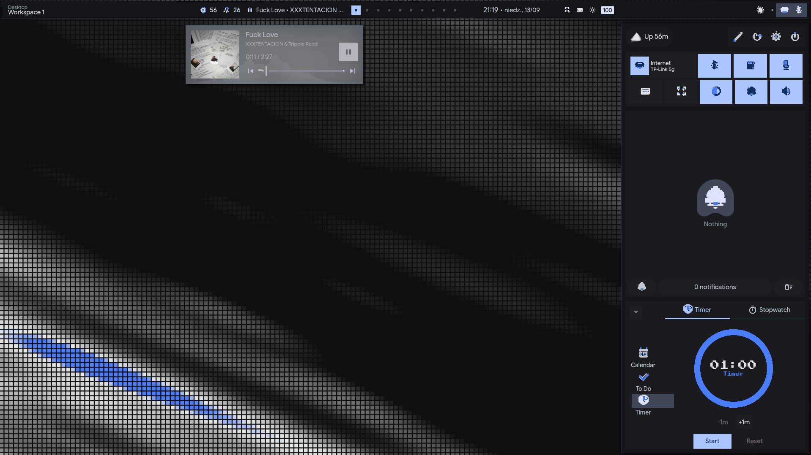

# TexFi Hyprland

A fork of [end-4/dots-hyprland](https://github.com/end-4/dots-hyprland) (illogical-impulse) in the TexFi pixel-art style.



## Install

First install the base illogical-impulse setup (if you don't have it yet):
<https://end-4.github.io/dots-hyprland/>

Then, one command to lay TexFi on top (clones the repo, since the installer
needs the config/font/wallpaper files that ship next to it — piping just the
script into `bash` won't work):

```bash
git clone --branch texfi-skin --depth 1 https://github.com/mistqkw/texfi-hyprland.git /tmp/texfi-hyprland && bash /tmp/texfi-hyprland/install-texfi.sh
```

## License

GPL-3.0, same as upstream — see [LICENSE](../LICENSE).
